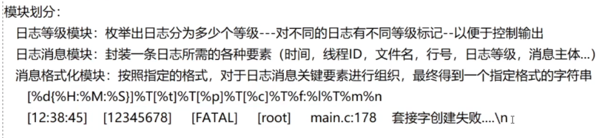

# 相关技术补充

## 不定参函数

### 不定参宏函数

不定参宏函数是一种特殊的宏定义，允许传入可变数量的参数。其本质是通过 `__VA_ARGS__` 来接收传入的参数，类似于函数中的可变参数列表。结合宏内置的 `printf` 函数，可以在编译时直接扩展出相应的参数和格式字符串。

示例代码：

```c
// ANSI color codes
#define CLR_RED "\033[1;31m"
#define CLR_GREEN "\033[1;32m"
#define CLR_YELLOW "\033[1;33m"
#define CLR_BLUE "\033[1;34m"
#define CLR_RESET "\033[0m"

// 彩色日志宏（默认使用绿色输出）
#define LOG(fmt, ...) \
    printf(CLR_YELLOW "[%s : %d] " fmt CLR_RESET "\n", __FILE__, __LINE__, ##__VA_ARGS__)
```

### 理解：

1. **宏定义中的占位符：** `LOG` 宏接收格式字符串 `fmt` 和任意数量的参数 `__VA_ARGS__`。通过 `printf` 输出时，`fmt` 中的占位符会被 `__VA_ARGS__` 中的参数所替换，类似于使用标准的 `printf` 函数。
2. **ANSI颜色代码：** 宏中使用了ANSI颜色代码（例如：`CLR_YELLOW`），将输出的颜色修改为黄色。在 `printf` 输出时，`fmt` 中的文本将被颜色格式化输出，这有助于在终端中更清晰地显示不同类型的日志。
3. **日志输出格式：** 在输出的每条日志前，都会添加当前源文件的名称和行号，这有助于追溯日志的来源。
4. **`##__VA_ARGS__` 的作用：** `##` 是 GCC 扩展，它的作用是当没有传递额外参数时，忽略掉多余的逗号。这样，宏可以灵活地处理不同数量的参数。

### 总结：

不定参宏函数可以方便地封装和简化日志输出功能，允许用户通过传递不同的参数快速进行不同类型的输出，同时确保输出格式和颜色的一致性。

## C++ 风格不定参函数

C++中，支持不定参函数（variadic functions）的实现方式有多种。常见的方式包括使用C风格的 `va_list` 以及现代C++的模板和递归展开方法。下面为几种实现方法的总结。

### 1. C 风格不定参函数（`va_list`）

使用 `va_list` 和相关宏来实现可变参数的处理。在 C 风格的实现中，通过 `va_list` 和相关的 `va_start`、`va_arg` 和 `va_end` 宏来管理不定参。

```cpp
#include <iostream>
#include <cstdarg>

void printNum(int n, ...) {
    va_list al;
    va_start(al, n); // 让 al 指向 n 参数之后的第一个可变参数

    for (int i = 0; i < n; i++) {
        int num = va_arg(al, int); // 从可变参数中取出一个整型参数
        std::cout << num << std::endl;
    }

    va_end(al); // 清空可变参数列表，实际是将 al 置空
}

int main() {
    printNum(3, 11, 22, 33); // 输出：11 22 33
    printNum(5, 44, 55, 66, 77, 88); // 输出：44 55 66 77 88
    return 0;
}
```

**解释：**

1. `va_start(al, n)`：初始化 `al`，使其指向第一个可变参数。
2. `va_arg(al, int)`：获取一个整型参数。
3. `va_end(al)`：结束可变参数的处理，清理 `va_list`。

### 2. 使用 `vasprintf` 函数的不定参函数

```cpp
#include <iostream>
#include <cstdarg>

void myprintf(const char *fmt, ...) {
    char *res;
    va_list al;
    va_start(al, fmt);
    int len = vasprintf(&res, fmt, al); // 将格式化结果存储到 res
    va_end(al);
    std::cout << res << std::endl; // 输出格式化后的字符串
    free(res); // 释放内存
}

int main() {
    myprintf("%s-%d", "小明", 18); // 输出：小明-18
    return 0;
}
```

**解释：**

- `vasprintf` 是一个可以格式化不定参数并返回一个动态分配内存的字符串函数。
- 使用 `va_list` 和 `va_start` 来处理不定参，`va_start` 会将参数指针锁定在格式化字符串 `fmt` 后的第一个参数位置。
- `vasprintf` 将根据格式字符串格式化不定参数，并将结果存储在 `res` 字符串中。
- 格式化后的字符串 `res` 会被输出，然后释放掉分配的内存。

**注意：**

- `vasprintf` 返回的是格式化后的字符串的长度，如果格式化成功返回的 `len` 不为 `-1`，否则返回 `-1` 表示失败。
- 调用 `vasprintf` 后，记得要用 `free` 来释放动态分配的内存，避免内存泄漏。

### 3. C++ 风格不定参函数（模板和递归展开）

C++11 引入了模板和递归展开的方式来处理不定参函数，这种方式更加灵活且不依赖于 `va_list`。

```cpp
#include <iostream>
#include <cstdarg>
#include <memory>
#include <functional>

void xprintf() {
    std::cout << std::endl;
}

template<typename T, typename ...Args>
void xprintf(const T &value, Args &&...args) {
    std::cout << value << " ";
    if ((sizeof ...(args)) > 0) {
        xprintf(std::forward<Args>(args)...); // 递归展开
    } else {
        xprintf();
    }
}

int main() {
    xprintf("比特"); // 输出 ：比特
    xprintf("比特", 666); // 输出：比特 666
    xprintf("比特", "就业课", 666); // 输出：比特 就业课 666
    return 0;
}
```

**解释：**

1. **递归展开：** 使用模板参数包和递归调用来展开每一个传入的参数。
2. **`sizeof ...(args)`：** 这个表达式返回传递给模板的参数个数。
3. **`std::forward`：** 保证完美转发参数类型，避免不必要的类型转换。

### 总结：

- **C风格**的不定参函数通过 `va_list` 来手动处理可变参数，适用于大部分C++函数。
- **C++风格**不定参函数使用模板和递归展开来替代传统的 `va_list`，使得代码更加类型安全且易于维护。
- 使用 `va_list` 的方式适合简单的场景，而模板和递归展开的方式则更加现代且灵活。

这种方式在处理可变参数时既保留了C语言的兼容性，又充分利用了C++的类型系统，使得不定参函数在C++中得到了更广泛的应用。

## 设计模式

### 六大原则

设计模式是前辈们对代码开发经验的总结，是解决特定问题的一系列套路。它不是语法规定，而是用来提高**代码可复用性、可维护性、可读性、稳健性以及安全性**的解决方案。其中，**六大设计原则**是设计模式的核心理念：

---

#### 1️⃣ 单一职责原则（Single Responsibility Principle）

- **定义**：一个类应该仅有一个引起它变化的原因。即每个类应当只有一个职责。
- **目的**：职责划分清晰，使代码更易维护，改动更具针对性。
- **使用建议**：将完全不相干的功能分离为不同的类，一个类中只包含强相关的函数和数据。
- **应用案例**：网络聊天系统中，网络通信与聊天功能应拆分为 `网络通信类` 和 `聊天逻辑类`。

---

#### 2️⃣ 开闭原则（Open/Closed Principle）

- **定义**：对扩展开放，对修改封闭。
- **目的**：尽可能通过扩展来应对变化，而不是通过修改已有代码，以减少风险。
- **使用建议**：使用继承、多态、策略模式等来实现扩展功能。
- **应用案例**：商品定价系统中，不修改原商品价格逻辑，而是通过新增“促销价格”类扩展功能。

---

#### 3️⃣ 里氏替换原则（Liskov Substitution Principle）

- **定义**：所有引用父类的地方必须能透明地使用其子类对象。
- **目的**：保证继承关系的正确性，避免运行时异常。
- **使用建议**：
  - 子类必须完全实现父类方法；
  - 子类可以拓展新功能，但不能违背父类原有行为；
  - 尽量不暴露子类的 `public` 方法，避免外部依赖具体子类行为。
- **应用案例**：`运动员`类作为父类，`长跑运动员` 和 `短跑运动员` 是其子类，均继承“会跑步”的能力并拓展特长。

---

#### 4️⃣ 依赖倒置原则（Dependence Inversion Principle）

- **定义**：高层模块不应该依赖低层模块，两者都应该依赖抽象；抽象不应依赖细节，细节应依赖抽象。
- **目的**：通过抽象（接口）降低模块之间的耦合，提高系统灵活性和可维护性。
- **使用建议**：
  - 使用接口或抽象类来构建模块之间的依赖关系；
  - 尽量不要直接依赖具体类；
  - 避免重写基类方法。
- **应用案例**：
  - ❌ `奔驰车司机类` 只能开奔驰；
  - ✅ `司机类` 接口 + `汽车` 接口，高层模块（司机）依赖抽象，不依赖具体车类。

---

#### 5️⃣ 接口隔离原则（Interface Segregation Principle）

- **定义**：客户端不应该被迫依赖它不需要的接口。即使用多个小的、精简的接口，而不是一个庞大臃肿的接口。
- **目的**：降低类之间的耦合度，使系统更灵活。
- **使用建议**：
  - 接口应具有专一性；
  - 避免为实现无意义方法而被迫实现冗余接口。
- **应用案例**：
  - ❌ `用户信息接口` 包含修改密码功能；
  - ✅ `修改密码接口` 单独设计，职责明确，接口精细。

---

#### 6️⃣ 迪米特法则（Law of Demeter）

- **定义**：又称“最少知道原则”，一个对象应尽可能少地了解其他对象，不与陌生类交流。
- **目的**：减少类之间的耦合，提升系统模块独立性。
- **使用建议**：
  - 只与直接朋友通信；
  - 若一个方法可以安全放在类内，就不放到外部；
  - 拒绝链式调用过长或对象穿透式访问。
- **应用案例**：
  - ❌ 老师遍历学生点名；
  - ✅ 老师只把名单交给班长，班长完成点名后返回结果。

---

#### 🧾 总结口诀

> 用抽象构建框架，用实现扩展细节。

- 单一职责：一个类只做一件事；
- 开闭原则：扩展功能不改老代码；
- 里氏替换：子类能完美代替父类；
- 依赖倒置：面向接口编程；
- 接口隔离：接口尽量小而精；
- 迪米特法则：降低耦合、少知道点儿。

### 单例模式

**定义**：
单例模式（Singleton Pattern）保证一个类在系统中只能存在一个实例，并提供全局访问点。它常用于管理共享资源（如配置对象、线程池、数据库连接池等）。

**应用场景**：

- 系统配置管理类
- 日志类
- 线程池、数据库连接池管理器
- 文件系统或窗口管理器

---

#### ✅ 单例模式的核心点：

- 构造函数私有化，防止外部直接实例化；
- 禁止拷贝构造和赋值运算，防止复制；
- 提供一个静态方法来获取唯一实例。

---

#### 🔥 饿汉模式（Eager Singleton）

**定义**：程序一启动就创建好唯一实例。
**优点**：线程安全、实现简单。
**缺点**：可能占用不必要资源（若未使用）。
**适用场景**：单例对象初始化开销小，频繁使用，且对资源要求不敏感的场景。

**代码示例**：

```cpp
template<typename T>
class Singleton {
private:
    static Singleton _eton;
    Singleton() {}
    ~Singleton() {}

public:
    Singleton(const Singleton&) = delete;
    Singleton& operator=(const Singleton&) = delete;

    static T& getInstance() {
        return _eton;
    }
};

template<typename T>
Singleton<T> Singleton<T>::_eton;
```

---

#### 🐢 懒汉模式（Lazy Singleton）

**定义**：第一次使用时再创建实例对象。
**优点**：节省资源，按需加载。
**缺点**：多线程中需要确保线程安全。
**适用场景**：单例创建开销大或使用频率不高。

**Meyers Singleton（推荐方式，C++11 起线程安全）**：

```cpp
template <typename T> 
class Singleton { 
private:
    Singleton() {}
    ~Singleton() {}

public: 
    Singleton(const Singleton&) = delete;
    Singleton& operator=(const Singleton&) = delete;

    static T& getInstance() {
        static T _eton;
        return _eton;
    } 
};
```

---

**总结对比**：


| 特性       | 饿汉模式         | 懒汉模式（Meyers）       |
| ---------- | ---------------- | ------------------------ |
| 初始化时机 | 程序启动时       | 第一次调用时             |
| 线程安全性 | 天生线程安全     | C++11 后局部静态变量安全 |
| 性能       | 启动慢但调用快   | 启动快但第一次调用慢     |
| 资源利用   | 占资源但及时可用 | 节省资源但延迟初始化     |

---

需要我继续整理其他设计模式吗？可以一个一个来～

这里是关于 C++ 中“抽象工厂模式（Abstract Factory）”的笔记，已用 Markdown 格式整理，包含核心概念、代码示例和适用场景，供你参考与学习。

---

### 抽象工厂模式

#### ✅ 定义

**抽象工厂模式**是  一种创建型设计模式，它提供一个接口，用于创建**一族相关或相互依赖的对象**，而无需指定它们的具体类。

> 与工厂方法模式的区别在于：抽象工厂**创建多个产品（产品族）**，而工厂方法只创建一个产品（产品等级结构）中的对象。

---

#### 🎯 解决问题

当系统中存在**多个产品族**（例如不同品牌的 CPU 和主板），并希望系统能够**独立于产品的创建和组合方式变化**时，适合使用抽象工厂模式。

---

#### 🧩 模式结构（类图）

```
+--------------------+       +-------------------------+
| AbstractFactory    |<>---->| AbstractProductA        |
| +createProductA()  |       +-------------------------+
| +createProductB()  |       | +use()                  |
+--------------------+       +-------------------------+
         ^
         |
+--------------------+       +-------------------------+
| ConcreteFactory1   |       | ProductA1               |
| +createProductA()  |       +-------------------------+
| +createProductB()  |       | +use()                  |
+--------------------+       +-------------------------+

         |                          +-------------------------+
         |                          | ProductB1               |
         |                          +-------------------------+
         |                          | +use()                  |
         |                          +-------------------------+

（ProductA2/ProductB2 为另一种产品族）
```

---

#### 💡 示例场景

设计一个电脑配件工厂，可以生产不同品牌的 `CPU` 和 `MainBoard`，例如：

- 华硕工厂生产 AsusCPU 和 AsusMainBoard
- 联想工厂生产 LenovoCPU 和 LenovoMainBoard

---

#### 🧪 示例代码（C++）

```cpp
#include <iostream>
#include <memory>
using namespace std;

// 抽象产品 A：CPU
class CPU
{
public:
    virtual void compute() = 0;
    virtual ~CPU() = default;
};

// 抽象产品 B：主板 MainBoard
class MainBoard
{
public:
    virtual void installCPU() = 0;
    virtual ~MainBoard() = default;
};

// 具体产品 A1：华硕 CPU
class AsusCPU : public CPU
{
public:
    void compute() override
    {
        cout << "华硕 CPU 正在计算...\n";
    }
};

// 具体产品 B1：华硕主板
class AsusMainBoard : public MainBoard
{
public:
    void installCPU() override
    {
        cout << "正在将华硕 CPU 安装到华硕主板上...\n";
    }
};

// 具体产品 A2：联想 CPU
class LenovoCPU : public CPU
{
public:
    void compute() override
    {
        cout << "联想 CPU 正在计算...\n";
    }
};

// 具体产品 B2：联想主板
class LenovoMainBoard : public MainBoard
{
public:
    void installCPU() override
    {
        cout << "正在将联想 CPU 安装到联想主板上...\n";
    }
};

// 抽象工厂：电脑工厂
class ComputerFactory
{
public:
    virtual unique_ptr<CPU> createCPU() = 0;
    virtual unique_ptr<MainBoard> createMainBoard() = 0;
    virtual ~ComputerFactory() = default;
};

// 具体工厂：华硕工厂
class AsusFactory : public ComputerFactory
{
public:
    unique_ptr<CPU> createCPU() override
    {
        return make_unique<AsusCPU>();
    }

    unique_ptr<MainBoard> createMainBoard() override
    {
        return make_unique<AsusMainBoard>();
    }
};

// 具体工厂：联想工厂
class LenovoFactory : public ComputerFactory
{
public:
    unique_ptr<CPU> createCPU() override
    {
        return make_unique<LenovoCPU>();
    }

    unique_ptr<MainBoard> createMainBoard() override
    {
        return make_unique<LenovoMainBoard>();
    }
};

// 客户端函数：组装电脑
void assembleComputer(unique_ptr<ComputerFactory> factory)
{
    auto cpu = factory->createCPU();
    auto mb = factory->createMainBoard();
    mb->installCPU();
    cpu->compute();
}

int main()
{
    cout << "--- 组装华硕电脑 ---\n";
    assembleComputer(make_unique<AsusFactory>());

    cout << "\n--- 组装联想电脑 ---\n";
    assembleComputer(make_unique<LenovoFactory>());

    return 0;
}

```

---

#### ⚖️ 抽象工厂 vs 工厂方法 vs 简单工厂


| 模式     | 产品个数           | 产品族支持 | 扩展性   | 简单性     |
| -------- | ------------------ | ---------- | -------- | ---------- |
| 简单工厂 | 1 个（单一职责）   | ❌         | 较差     | ⭐⭐⭐⭐⭐ |
| 工厂方法 | 多个类（同类产品） | ❌         | ⭐⭐⭐⭐ | ⭐⭐⭐     |
| 抽象工厂 | 多个类（产品族）   | ✅         | ⭐⭐⭐   | ⭐⭐       |

---

#### 📌 优点

- 封装产品族的创建过程，解耦使用者和创建者。
- 易于切换产品族（只需更换工厂类）。
- 保证了产品族的一致性（不混用品牌）。

#### ⚠️ 缺点

- **扩展新的产品等级结构（如新增一个“电源”）较麻烦**，需修改所有工厂接口及子类。
- 抽象程度更高，结构更复杂，不适合产品种类固定、变化不大的情况。

---

#### ✅ 适用场景

- 系统需要独立于产品的创建与组合。
- 系统中存在多个产品族，但只使用其中一个族的产品。
- 希望提供产品族的一致接口，避免品牌混用。

### 建造者模式

建造者模式（Builder Pattern）是一种创建型设计模式，**将一个复杂对象的构建与它的表示分离**，使得同样的构建过程可以创建不同的表示。

适用场景：

- 构建复杂对象的过程独立于其组成部分
- 对象的创建过程应该被封装以隐藏内部细节
- 同样的构建过程可以构建不同的产品对象

#### 优点

- **封装性好**：使用者无需知道构建细节
- **职责分离**：构建过程和表示分开，便于维护
- **灵活拓展**：可以通过替换建造者创建不同类型的对象

#### 结构组成（五大核心角色）

1. **抽象产品类（Product）**：定义产品的组成部件，如 `Computer`
2. **具体产品类（Concrete Product）**：实际构建出的对象，如 `MacBook`
3. **抽象建造者类（Builder）**：定义创建产品各个部件的接口
4. **具体建造者类（Concrete Builder）**：实现 Builder 接口，构建各部件
5. **指挥者类（Director）**：调用建造者的接口构建产品的过程

---

#### 示例代码（C++）

```cpp
#include <iostream>
#include <memory>
#include <string>

/* 抽象产品类 */
class Computer {
public:
    using ptr = std::shared_ptr<Computer>;
    void setBoard(const std::string &board) {_board = board;}
    void setDisplay(const std::string &display) {_display = display;}
    virtual void setOs() = 0;
    std::string toString() {
        return "Computer:{\n\tboard=" + _board + ",\n\tdisplay=" + _display + ",\n\tOs=" + _os + "\n}\n";
    }
protected:
    std::string _board, _display, _os;
};

/* 具体产品类 */
class MacBook : public Computer {
public:
    using ptr = std::shared_ptr<MacBook>;
    virtual void setOs() override {
        _os = "Mac OS X12";
    }
};

/* 抽象建造者 */
class Builder {
public:
    using ptr = std::shared_ptr<Builder>;
    virtual void buildBoard(const std::string &board) = 0;
    virtual void buildDisplay(const std::string &display) = 0;
    virtual void buildOs() = 0;
    virtual Computer::ptr build() = 0;
};

/* 具体建造者 */
class MacBookBuilder : public Builder {
public:
    using ptr = std::shared_ptr<MacBookBuilder>;
    MacBookBuilder(): _computer(new MacBook()) {}
    virtual void buildBoard(const std::string &board) override {
        _computer->setBoard(board);
    }
    virtual void buildDisplay(const std::string &display) override {
        _computer->setDisplay(display);
    }
    virtual void buildOs() override {
        _computer->setOs();
    }
    virtual Computer::ptr build() override {
        return _computer;
    }
private:
    Computer::ptr _computer;
};

/* 指挥者类 */
class Director {
public:
    Director(Builder* builder): _builder(builder) {}
    void construct(const std::string &board, const std::string &display) {
        _builder->buildBoard(board);
        _builder->buildDisplay(display);
        _builder->buildOs();
    }
private:
    Builder::ptr _builder;
};

/* 测试主函数 */
int main() {
    Builder *builder = new MacBookBuilder();
    std::unique_ptr<Director> pd(new Director(builder));
    pd->construct("英特尔主板", "VOC显示器");
    Computer::ptr computer = builder->build();
    std::cout << computer->toString();
    delete builder; // 别忘了释放资源
    return 0;
}
```

---

#### 总结

建造者模式本质是**“分步骤构建复杂对象”**，强调的是“构建过程的抽象”，适用于构造流程复杂或对象组成变化多的情况。
通过`Director`类来控制建造流程，用户只需传入参数和建造器，不关心内部如何一步步构建对象，极大提高了**封装性、扩展性和维护性**。

### 代理模式

**定义**：
代理模式指**通过代理对象来控制对其他对象的访问**。也就是说，代理对象控制对真实对象的引用。在某些情况下，一个对象不适合或无法直接被访问，而代理对象则可以在客户端和目标对象之间起到中介的作用。

---

#### 一、结构组成

代理模式的结构包括三个角色：

1. **抽象主题角色（接口/抽象类）**：
   * 定义代理类与真实类的共同接口，保证代理类可以代替真实对象。
2. **真实主题角色（目标类）**：
   * 实现了抽象主题，是代理模式中真正要访问的对象。
3. **代理类**：
   * 也实现了抽象主题，通过持有真实主题的引用，在调用真实对象的同时增加额外操作（如访问控制、日志、安全检查、延迟加载等）。

---

#### 二、代理模式分类

##### 1. 静态代理（Static Proxy）：

* **定义**：在编译时就已经确定好了代理类和被代理类的关系。
* **特点**：
  * 编译期间生成代理类。
  * 每个目标类都需要手动编写代理类。
* **适合场景**：结构较简单、类数量不多时。

##### 2. 动态代理（Dynamic Proxy）：

* **定义**：在运行时动态生成代理类，并与被代理类绑定。
* **特点**：
  * 使用语言特性如 Java 的反射、C++ 的函数指针或模板实现。
  * 可以为任意接口创建代理，不需要手动实现每个代理类。
* **适合场景**：系统中有大量的接口和重复代理逻辑时。

---

#### 三、举例说明：租房案例

以租房为例：房东将房子租出去，但涉及招租、看房、维修等事务。这些事情不一定由房东亲自处理，因此可以通过中介（代理对象）完成。

---

#### 四、代码实现：C++ 静态代理

```cpp
#include <iostream>
#include <string>

// 抽象主题接口
class RentHouse {
public:
    virtual void rentHouse() = 0;
};

// 真实主题：房东类
class Landlord : public RentHouse {
public:
    void rentHouse() override {
        std::cout << "将房子租出去\n";
    }
};

// 代理类：中介
class Intermediary : public RentHouse {
public:
    void rentHouse() override {
        std::cout << "发布招租启示\n";
        std::cout << "带人看房\n";
        _landlord.rentHouse();           // 调用真实对象
        std::cout << "负责租后维修\n";
    }

private:
    Landlord _landlord; // 持有目标对象
};

// 客户端调用
int main()
{
    Intermediary intermediary;
    intermediary.rentHouse();
    return 0;
}
```

---

#### 五、运行结果

```
发布招租启示
带人看房
将房子租出去
负责租后维修
```

---

#### 六、代理模式的优点

* 可以在不改变目标对象的前提下扩展其功能。
* 将客户端和目标对象进行解耦。
* 更加符合开闭原则。

---

#### 七、适用场景

* 远程代理：为一个对象在不同地址空间提供局部代表。
* 虚拟代理：根据需要创建开销大的对象。
* 安全代理：控制对真实对象的访问权限。
* 智能代理：在访问对象时执行一些附加操作（如缓存、日志等）。

# 框架设计




日志落地模块：负责队日志消息进行指定方向的写入输出

日志器模块：对上边几个模块的整合

```
日志限制输出等级，消息格式化模块对象，日志落地模块对象
同步日志模块 -- 完成日志的同步输出功能
异步日志模块 -- 完成日志的异步输出功能
异步线程模块 -- 负责异步日志的实际落地输出功能
单例的日志器管理模块 -- 对日志进行全局的管理，以便于能够在项目的任何位置获得指定的日志器进行日志输出
```
